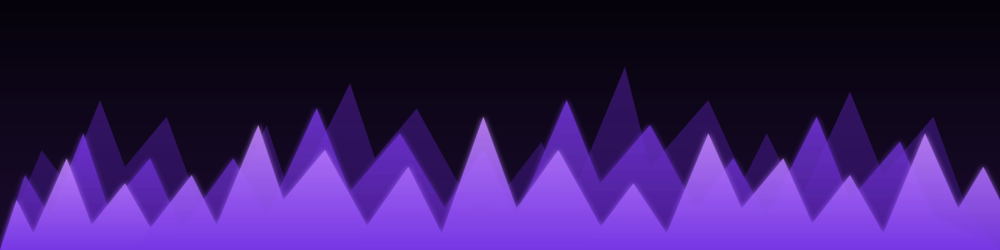

<!-- ─── Flame header (animated SVG) ─────────────────────── -->

 

<!-- ─── whoami ─────────────────────────────────────────── -->

<!-- ─── intro ──────────────────────────────────────────── -->

<!-- ─── hobby note ─────────────────────────────────────── -->

<!-- ─── principles ─────────────────────────────────────── -->

<!-- ─── closing ────────────────────────────────────────── -->

<!-- ─── contact ────────────────────────────────────────── -->

  

<!-- ─── QR ─────────────────────────────────────────────── -->
### 📇 Scan for everything

 

All repositories, in one place.

  

  

<!-- ─── Footer · capsule-render ember wave ─────────────── -->

© 2026 — Mohamed Cheikh · MC88

